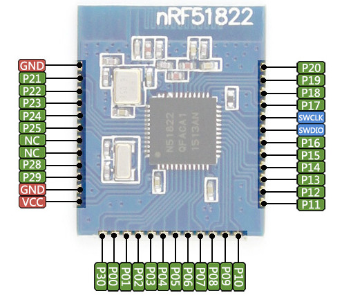
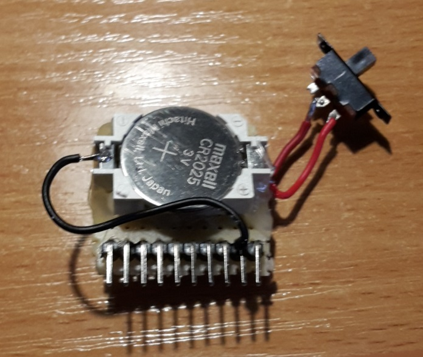
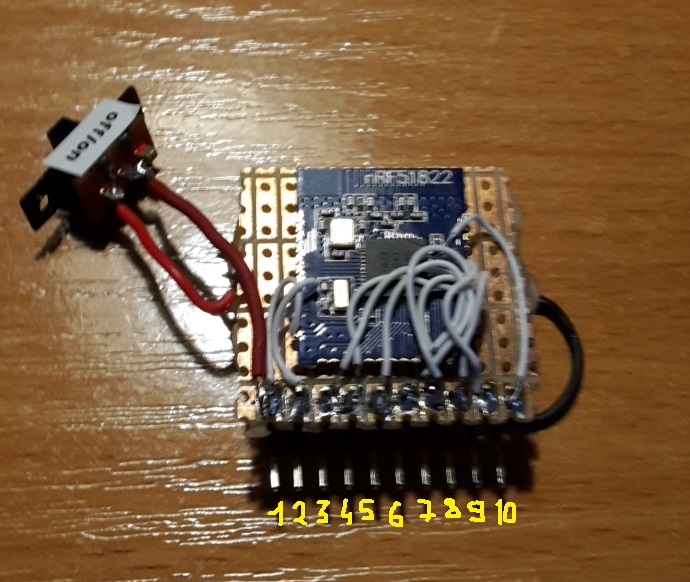
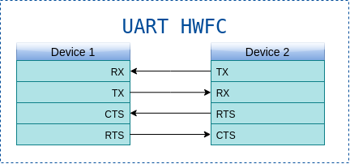
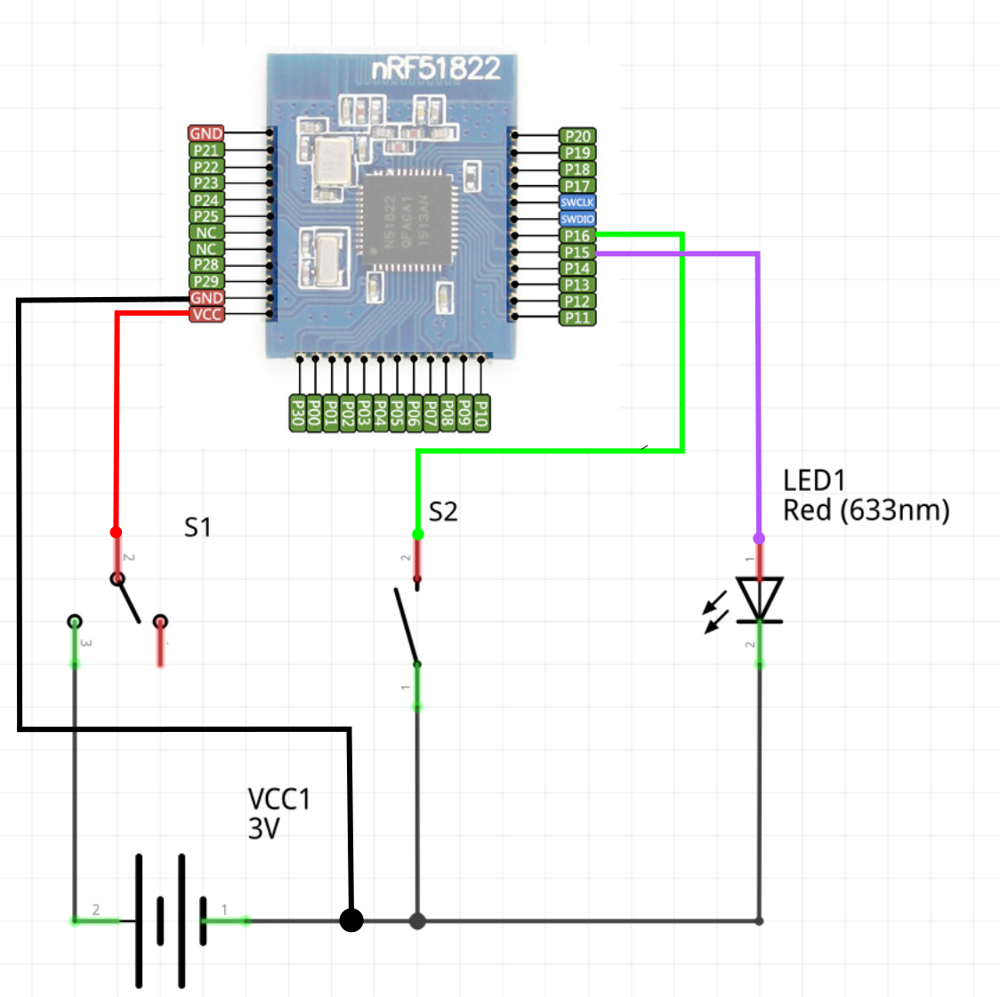
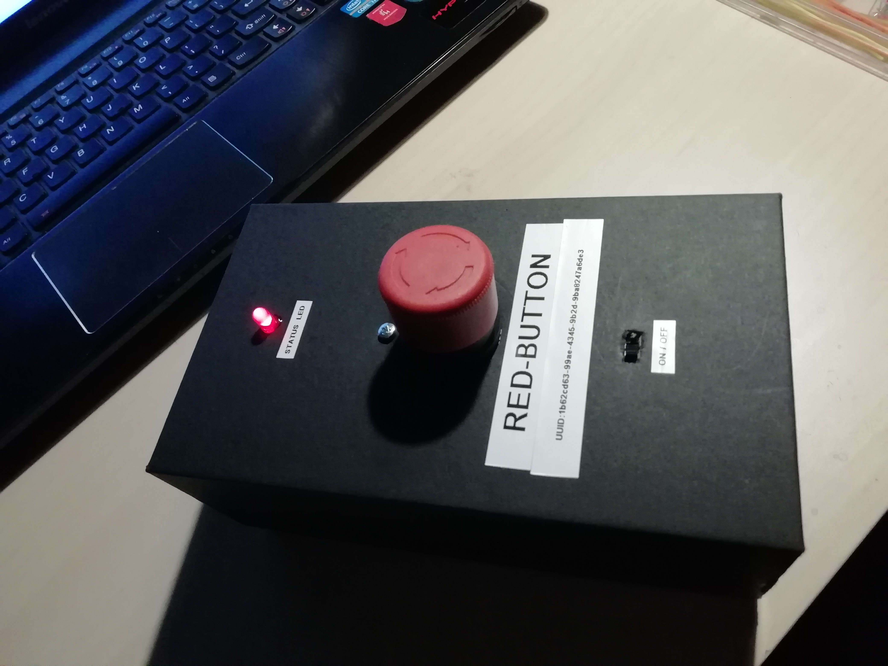
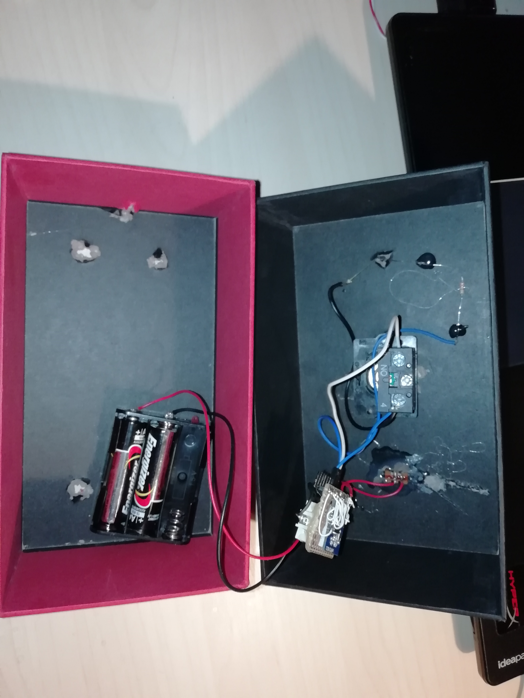
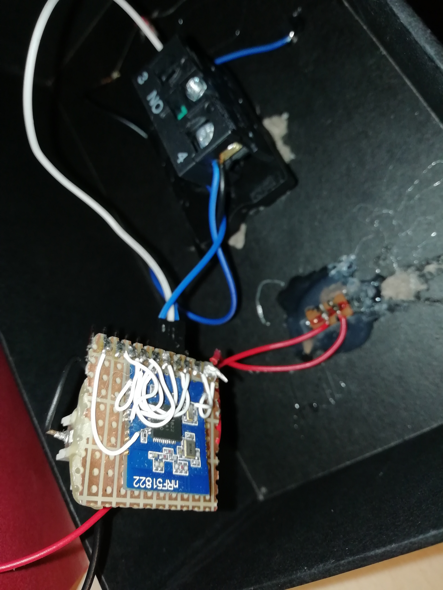

# Red Button - Emergency Push Button over BLE (nRF51822 + Mbed OS)

## Project Description:

### Goal
Use cheap nRF51822 BLE 4.0 module to publish emergency push button state in ble characteristic. 

Progress:
- [x] Basic Functionality
- [ ] Security and Pairing

### Used Bluetooth Low Energy solution
- **nRF51822 SoC**

<p align="center">

</p>
<p align="center">Used module</p>

<p align="center">

</p>
<p align="center">Home made brakeout board: back</p>

<p align="center">

</p>
<p align="center">Home made brakeout board: front</p>

**Connected pins:**
1. `VCC`
2. `GND`
3. `p16`
4. `p14`
5. `p8`
6. `p9`
7. `p10`
8. `p11`
9. `SWDIO`
10. `SWCLK`

### UART HWFC

```
# UART does not work without HWFC on nRF51_DK platform!
# Pin Names in code. Check TARGET_RB_BOARD/PinNames.h
RX_PIN_NUMBER  = p11
TX_PIN_NUMBER  = p9
CTS_PIN_NUMBER = p10
RTS_PIN_NUMBER = p8
```

<p align="center">

</p>
<p align="center">UART Hardware Flow Control Connections</p>

### Programming with nRF52_DK / nRF51_DK

**Connections:**

```
|\/\/\/\/\/\/\/\/\/\/\/\/\/\/\/\/\/\/\/\/\/\|
| nRF51-DK/nRF52-DK |\/\/\/\/\/\/| RB_BOARD |
|\/\/\/\/\/\/\/\/\/\/\/\/\/\/\/\/\/\/\/\/\/\|
|        VTG        |<---------->|     1    |
|    GND DETECT     |<---------->|     2    | 
|       SWDIO       |<---------->|     9    |
|       SWDCLK      |<---------->|     10   |
|\/\/\/\/\/\/\/\/\/\/\/\/\/\/\/\/\/\/\/\/\/\|    
```

Use `nrfjprog -f NRF51 -p firmware.hex --sectorerase` to program your board.

### Programming with ST-link
https://exploreembedded.com/wiki/Programming_nRF51822_with_STlink_on_Windows

### Hardware

<p align="center">

</p>
<p align="center">Schematic - add 330R resistor in series with LED! (omitted in picture))</p>

<p align="center">

</p>

<p align="center">

</p>

<p align="center">

</p>

## Advertising Data: 
* **Complete Local Name (0x09):** `RED-BUTTON`
* **Incomplete List of 128-bit Service UUIDs (0x06):** `1b62cd63-99ae-4345-9b2d-9ba8247a6de3`
## Web resources

* https://marketplace.visualstudio.com/items?itemName=marus25.cortex-debug
* https://marcelball.ca/projects/cortex-debug/
* https://marcelball.ca/projects/cortex-debug/cortex-debug-launch-configurations/
* https://github.com/ARMmbed/mbed-os
* https://os.mbed.com/docs/mbed-os/v5.11/apis/bluetooth.html

## Prerequisites
* [Visual Studio Code IDE](https://code.visualstudio.com/)
* [mbed-cli tools](https://os.mbed.com/docs/v5.11/tools/installation-and-setup.html)
* [GNU Arm Embedded version 6 toolchain](https://developer.arm.com/open-source/gnu-toolchain/gnu-rm/downloads)
* [nRF5x Command Line Tools](https://www.nordicsemi.com/DocLib/Content/User_Guides/nrf5x_cltools/latest/UG/cltools/nrf5x_command_line_tools_lpage)

## Setup

1. Create nrf51 workspace

```bash
$ mkdir nrf51-workspace && cd nrf51-workspace
```

2. Import mbed-os to the directory

```bash
$ mbed import mbed-os
```

3. This project uses Mbed OS `v5.11.5` so you have to checkout to appropriate branch / tag.

4. Create `.mbedignore` in `mbed-os` directory and add:

```
features/cellular/*
features/cryptocell/*
features/deprecated_warnings/*
features/FEATURE_BOOTLOADER/*
features/frameworks/*
features/lorawan/*
features/lwipstack/*
features/nanostack/*
features/netsocket/*
features/nfc/*
features/unsupported/*
components/wifi/*
components/802.15.4_RF/*
components/TARGET_PSA/*
usb/*
```

5. Set path to mbed-os in Mbed CLI

```bash
$ mbed config -G MBED_OS_DIR <path>/nrf51-workspace/mbed-os
```

6. Import template

```bash
$ git clone https://github.com/byq77/red-button.git
```

6. Set path to `arm-none-eabi-gcc` in `settings.json`
```json
{
    "C_Cpp.default.compilerPath": "~/opt/gcc-arm-none-eabi-6-2017-q2-update/bin/arm-none-eabi-g++"
}
```

## Tasks

To compile/flash:
* `CTRL + SHIFT + P`, type `Tasks: Run Task` and select task.

## Debug

To debug:
* install extension: https://marketplace.visualstudio.com/items?itemName=marus25.cortex-debug
* compile and flash DEBUG firmware
* `CTRL + SHIFT + D` and click on `start debug` button